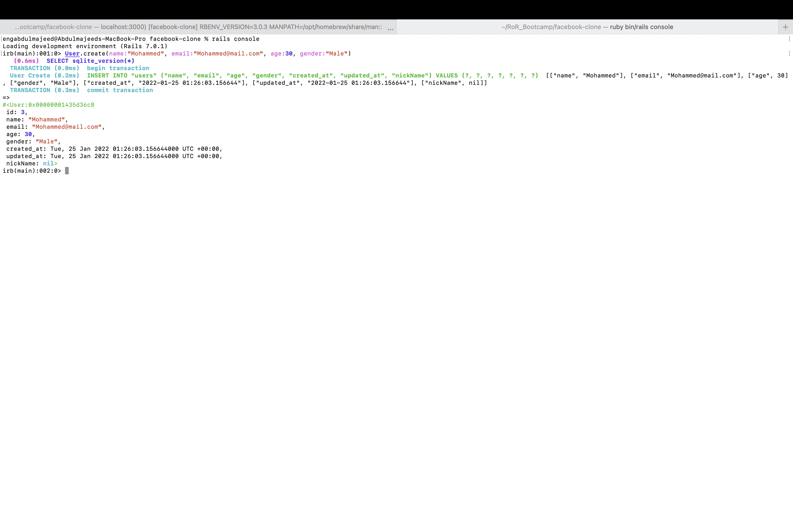
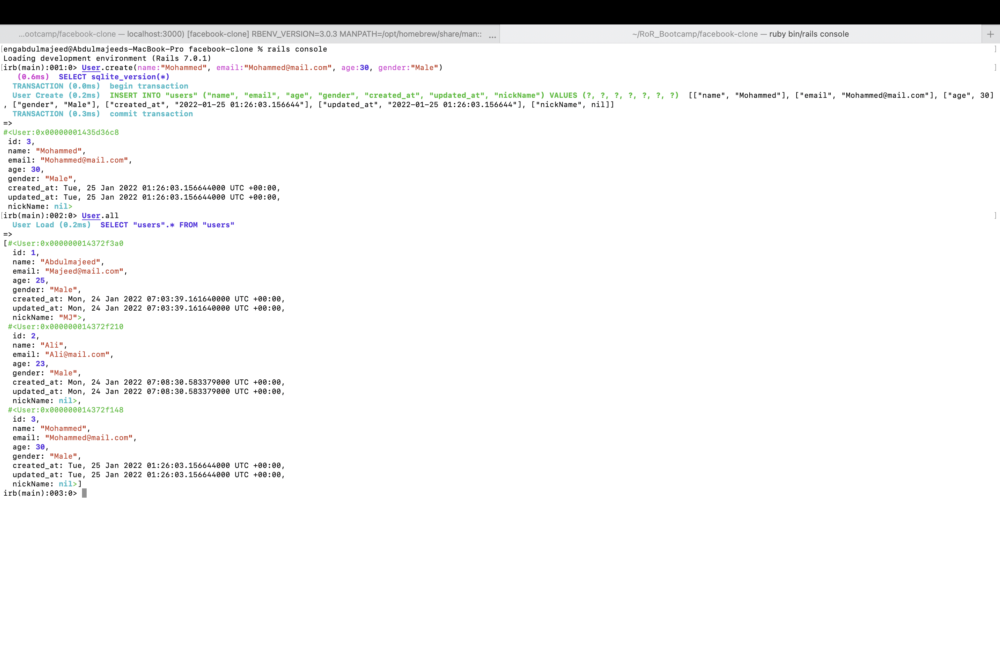
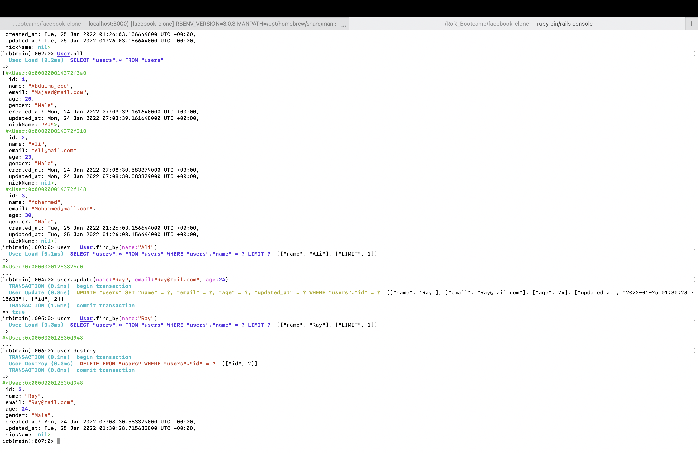
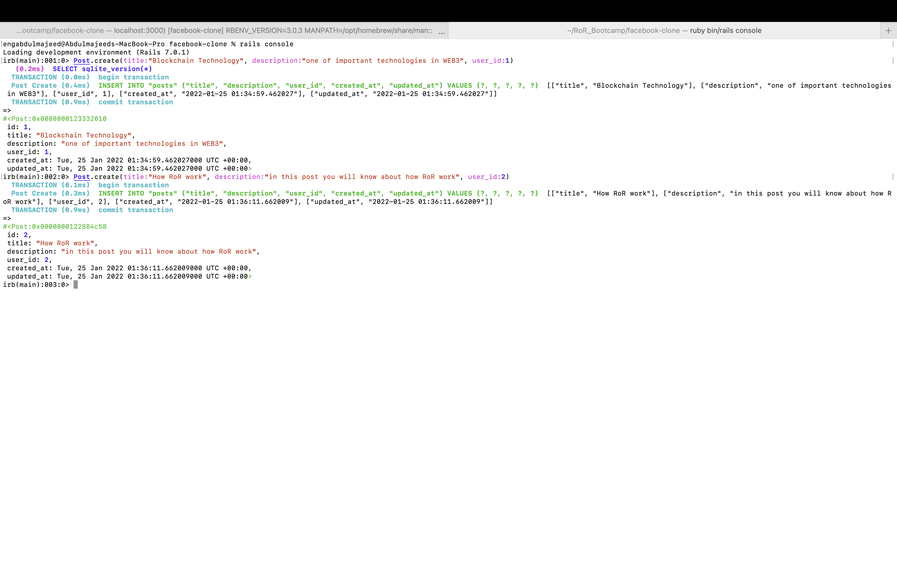
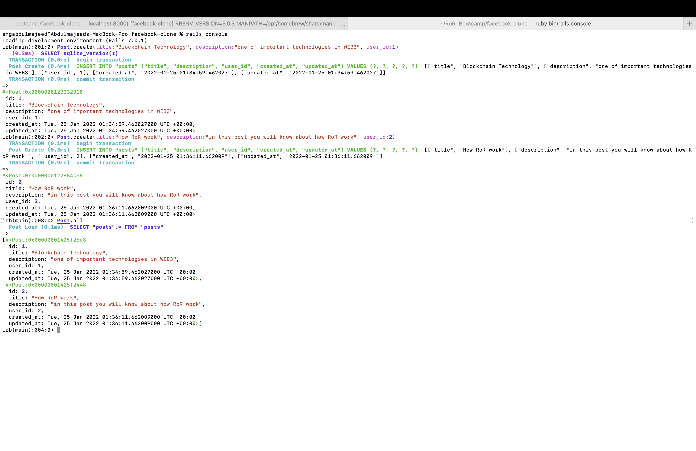
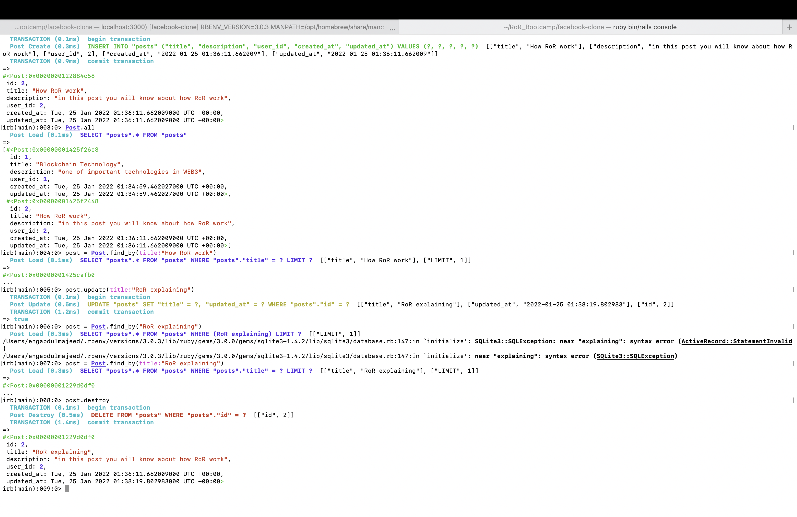

# Facebook-clone Project

## Overview

This is ruby on rails project with two table:
* Users table (name, E-mail, age, gender)
* Posts table (title, description, user_id)

## Technologies Used

* Ruby 3.0.3

* Ruby on Rails (RoR) 7.1

* Sqlite3 DataBase

* Visual Studio (VS Code)

__________

## CRUD operations on users table
> users(name:string, email:string, age:integer, gender:string)

### 1- Create users:

### 2- Read users:

### 3- Update users:

### 4- Delete users:

____
## CRUD operations on posts table
> users(title:string, desciption:string, user_id:string:uniq)

### 1- Create posts:

### 2- Read posts:

### 3- Update posts:

### 4- Delete posts:
